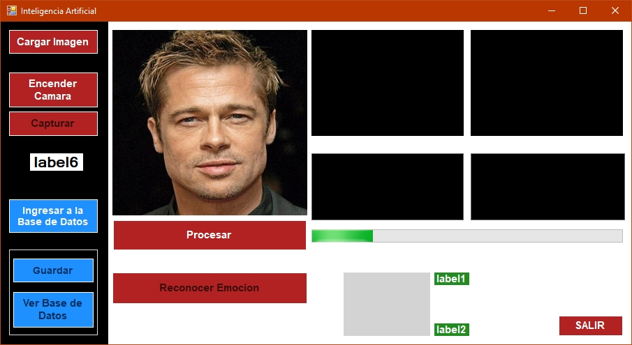
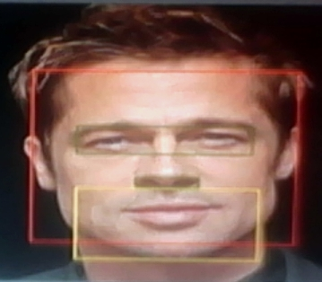
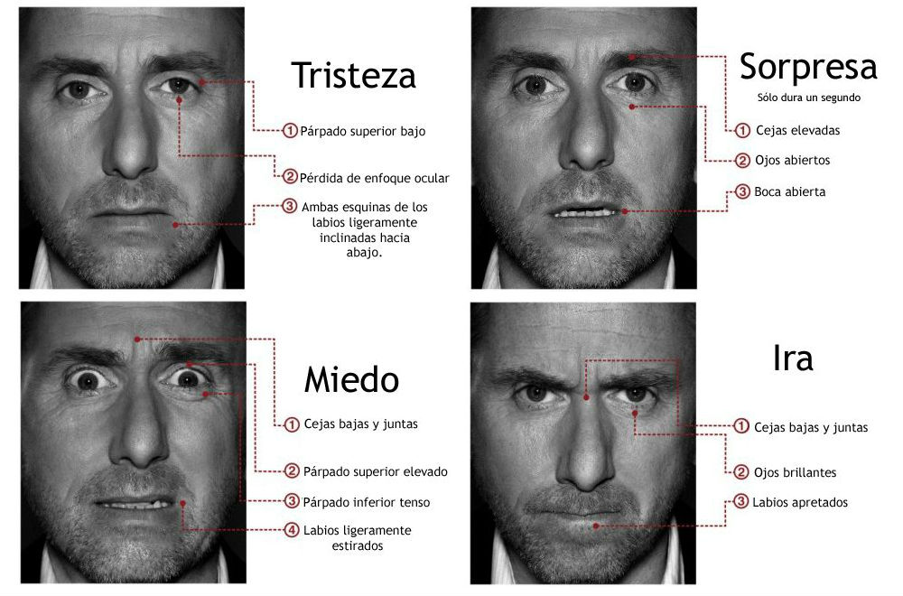

reconocimiento-emociones
=

**App de Escritorio** que reconoce el tipo de emoción expresada en los rostros de imagenes.

## Herramientas usadas

- Lenguaje de Programacion: `C#`
- EmguCV
- OpenCV
- Base de datos local: `AccessDB`
- IDE: Visual Studio 2015 Community

## Interfaz

## Patrones en el Rostro

## Técnica de Reconocimiento Utilizada
